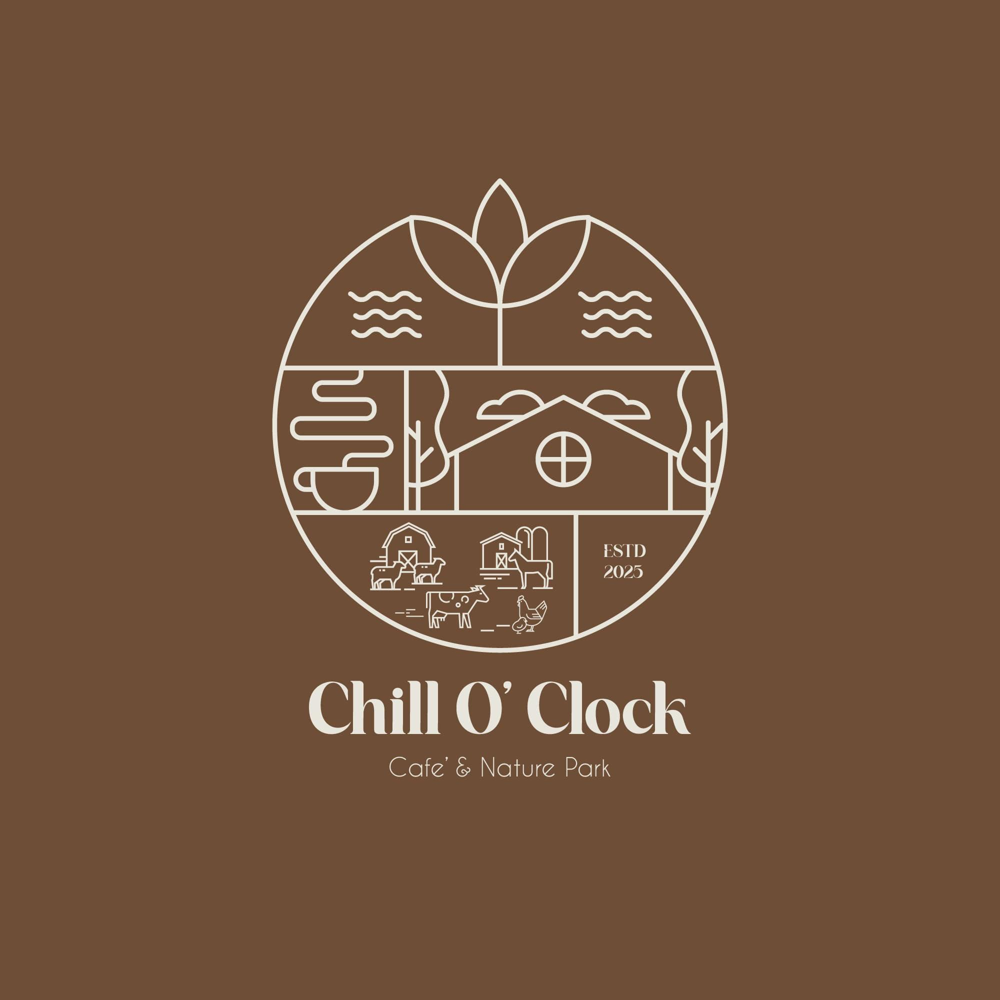

# ☕ Chill o'clock Cafe

A responsive and interactive menu web app for a cozy, pet-friendly cafe — **Chill o'clock Cafe**. This is a single-page application built with HTML, CSS, and JavaScript showcasing an engaging user interface to browse through various drink, food, and pet-friendly menu items.

🌐 **Live Demo**: [chilloclock.netlify.app](https://chilloclock.netlify.app/)

---

## 📸 Logo

  

---

## 🧾 Features

* 📁 Tab-based category navigation for:

  * Coffee
  * Sparkling Refreshers
  * Smoothies
  * Food & Snacks
  * Pet-Friendly Menu
  * Additional Services
* 🌟 Interactive and animated UI
* 🐾 Pet-friendly offerings and amenities
* 🌱 Smooth, responsive layout using **vanilla CSS grid**
* 📱 Mobile-friendly and touch-optimized

---

## 🛠️ Tech Stack

* **HTML5** – semantic and structured markup
* **CSS3** – custom styling with responsive design
* **JavaScript** – tab-switching logic and user interaction

---

## 📂 Project Structure

```
chilloclock-cafe/
├── index.html      # Main HTML file
├── style.css       # Styling for the app
└── script.js       # JS logic for category tab switching
```

---

## 🚀 Getting Started Locally

1. Clone this repository:

   ```bash
   git clone https://github.com/yourusername/chilloclock-cafe.git
   ```

2. Open the folder in your code editor.

3. Open `index.html` in your browser.

   Or use VS Code Live Server extension for live updates.

---

## 📜 License

This project is for personal use, learning, and fun. Feel free to explore and learn from the code.

---

## 🫶 Credits

* Images are sourced from Unsplash, Freepik, Shutterstock, and product sources.
* Concept and design by Sai Htoo Thit Aung and team.

---
